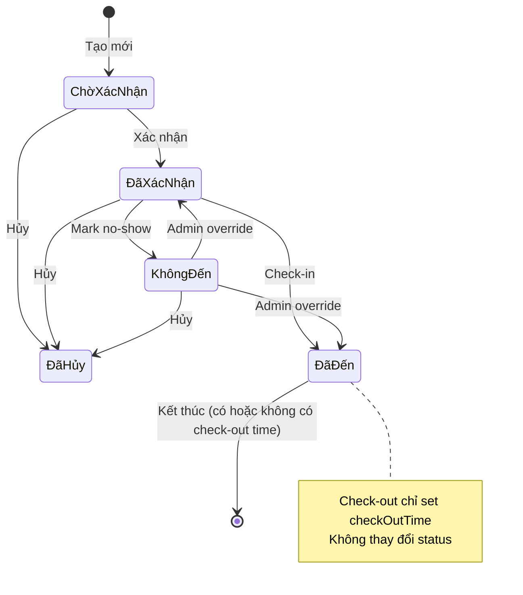

# 🧩 Requirements: Appointment Management System

> **📋 STATUS: ✅ IMPLEMENTED** - Backend + Frontend complete  
> **📄 Feature Documentation**: `docs/features/008_Appointment.md` (placeholder)  
> **🔗 Implementation**: `src/features/appointments/`, `src/app/(private)/appointments/`, `src/app/api/v1/appointments/` > **🔧 Last Updated**: 2025-11-03 - Added walk-in logic clarification

## 📊 Tham khảo

- Prisma Model Appointment: `prisma/schema.prisma`
- Validation Schema: `src/shared/validation/appointment.schema.ts`
- Constants: `src/features/appointments/constants.ts`

## 🎯 Mục Tiêu & Phạm Vi

- ✅ Chuẩn hóa quy trình quản lý lịch hẹn: tạo, sửa, xoá với validation nghiêm ngặt
- ✅ Phân quyền rõ ràng theo timeline (quá khứ/hôm nay/tương lai) cho Employee vs Admin
- ✅ Check-in/Check-out workflow với khả năng Admin override/sửa lỗi
- ✅ Dentist availability warning (soft warning, không block)
- ✅ Customer conflict prevention (1 khách/1 lịch/ngày)
- ✅ Cung cấp Daily View với KPI statistics và action buttons
- ✅ Status transition rules với audit trail đầy đủ
- ✅ Quyền truy cập & đa‑clinic: filter theo clinic user; admin chọn clinic qua tabs

---

## 🎲 Decision Log (Chuẩn Hoá)

### Database & Validation

- ✅ **Unique constraints**:
  - Một khách hàng chỉ có 1 lịch hẹn trong 1 ngày (validate ở server)
  - appointmentDateTime không được trong quá khứ khi tạo mới
- ✅ **appointmentDateTime**: Required, mặc định trống (user tự nhập)
- ✅ **duration**: Required, mặc định 30 phút
- ✅ **primaryDentistId**: Required (chọn từ working employees)
- ✅ **secondaryDentistId**: Optional (chọn từ working employees)
- ✅ **clinicId**: Required, mặc định clinic của user
- ✅ **status**: Required, mặc định "Chờ xác nhận"
- ✅ **checkInTime/checkOutTime**: Admin có thể edit nullable (để sửa lỗi)

### Repository Pattern

- ✅ **Complex + Server Fields** (như Customer):
  ```typescript
  type AppointmentCreateInput = CreateAppointmentRequest & {
    createdById: string;
    updatedById: string;
  };
  ```
- ✅ Không dùng Prisma relations pattern (đơn giản, audit trail đủ dùng)

### Permission Rules - Based on Timeline & Status

**Quyền hạn dựa trên:**

1. ⏰ **Timeline**: Quá khứ/Hôm nay/Tương lai
2. 📊 **Status**: Chờ xác nhận → Đã xác nhận → Đã đến (check-in) → Đã đến (check-out) | Không đến | Đã hủy
3. 👤 **Role**: Admin vs Employee
4. ❌ **KHÔNG** dựa trên clinic (cross-clinic collaboration)

**Lưu ý về Status Workflow:**

- Check-out **không** thay đổi status, chỉ set `checkOutTime`
- Status "Đã đến" là trạng thái cuối của appointment thành công (có thể có hoặc không có checkOutTime)

#### **CREATE (Tạo lịch):**

- ✅ **Employee & Admin**: Tạo được cho **bất kỳ clinic nào** (tương lai)
- ❌ Không tạo lịch trong quá khứ

#### **UPDATE (Sửa lịch):**

| Timeline      | Status                      | Employee Permissions                                                                                    | Admin         |
| ------------- | --------------------------- | ------------------------------------------------------------------------------------------------------- | ------------- |
| **Quá khứ**   | Any                         | ❌ Không sửa                                                                                            | ✅ Sửa tất cả |
| **Hôm nay**   | Chờ xác nhận<br>Đã xác nhận | ✅ Sửa: duration, dentist, clinic, status, notes, checkIn, checkOut<br>❌ Không sửa: customer, dateTime | ✅ Sửa tất cả |
| **Hôm nay**   | Đã đến<br>Đến đột xuất      | ❌ Không sửa (khóa sau khi check-in)                                                                    | ✅ Sửa tất cả |
| **Hôm nay**   | Không đến<br>Đã hủy         | ❌ Không sửa                                                                                            | ✅ Sửa tất cả |
| **Tương lai** | Any                         | ✅ Sửa tất cả (trừ checkIn/Out)                                                                         | ✅ Sửa tất cả |

#### **DELETE (Xóa lịch):**

| Timeline      | Status                                   | Employee     | Admin       |
| ------------- | ---------------------------------------- | ------------ | ----------- |
| **Quá khứ**   | Any                                      | ❌ Không xóa | ✅ Xóa được |
| **Hôm nay**   | Chờ xác nhận<br>Đã xác nhận              | ✅ Xóa được  | ✅ Xóa được |
| **Hôm nay**   | Đã đến/Đến đột xuất/<br>Không đến/Đã hủy | ❌ Không xóa | ✅ Xóa được |
| **Tương lai** | Any                                      | ✅ Xóa được  | ✅ Xóa được |

#### **QUICK ACTIONS (Check-in, Check-out, Confirm, No-show):**

**Quyền dựa trên CLINIC:**

- ✅ **Admin**: Thực hiện được tại **mọi clinic**
- ⚠️ **Employee**: Chỉ thực hiện được tại **clinic của mình**
  - ❌ Không check-in/out/confirm/no-show lịch hẹn của clinic khác
  - ✅ Có thể VIEW lịch hẹn cross-clinic (trong Customer Detail)
  - 💡 Rationale: Quick actions cần hiện diện tại clinic để thực hiện

**Quick Actions bao gồm:**

- `Check-in`: Đánh dấu khách đã đến
- `Check-out`: Đánh dấu khách đã xong
- `Confirm`: Xác nhận lịch hẹn
- `Mark No-show`: Đánh dấu không đến

### Multi-Clinic Collaboration

- ✅ **CREATE/UPDATE/DELETE**: Không giới hạn clinic (cross-clinic workflow)
- ⚠️ **QUICK ACTIONS**: Employee chỉ thực hiện tại clinic mình (on-site requirement)
- ✅ **Use case**: Employee clinic A tạo lịch cho clinic B → Employee clinic B xử lý & check-in
- ✅ **Workflow**: Cross-clinic booking, but on-site operations
- ✅ **Quyền dựa trên**:
  - CREATE/UPDATE/DELETE → Timeline & Status
  - Quick Actions → Clinic ownership

### Update Pattern (Admin Override)

- ✅ **Option 2: Full Edit** (1 endpoint PUT, flexible):
  - Admin có thể edit tất cả fields kể cả checkInTime/checkOutTime (nullable)
  - Admin xem được metadata (createdBy, updatedBy, timestamps)
  - Pattern giống Clinics/Dental-Service
  - Validation chặt chẽ ở server (business rules)

### Quick Actions Implementation

- ✅ **Gộp chung vào PUT endpoint**:
  - Check-in/checkout/confirm/mark-no-show đều dùng PUT /appointments/:id
  - Frontend: Các button gọi `useUpdateAppointment()` với payload nhỏ
  - Backend: Service layer tự detect action và apply business logic
  - Không tạo endpoints riêng (giảm complexity)

### Status Field Control

- ✅ **Employee**: Status field **disabled** trong Create/Update forms
  - Status thay đổi thông qua quick actions workflow
  - Create → mặc định "Chờ xác nhận"
  - Check-in → chuyển sang "Đã đến" (set checkInTime + status)
  - Check-out → vẫn giữ "Đã đến" (chỉ set checkOutTime, không đổi status)
  - Confirm → chuyển sang "Đã xác nhận"
  - Mark No-show → chuyển sang "Không đến"
  - Cancel → chuyển sang "Đã hủy"
- ✅ **Admin**: Status field **enabled** trong tất cả forms
  - Có thể thay đổi status thủ công để sửa lỗi
  - Có quyền override bất kỳ status nào

### Status "Đến đột xuất" (Walk-in)

**Definition**: Khách hàng đến không hẹn trước → Tạo appointment + auto check-in ngay

**Đặc điểm:**

- ✅ Marker để phân biệt walk-in (createdAt ≈ appointmentDateTime)
- ✅ Luôn có `checkInTime` (auto-set khi tạo)
- ✅ **Treated same as "Đã đến"** trong tất cả logic:
  - Validation: Cho phép có checkInTime
  - Permissions: Khóa edit/delete giống "Đã đến"
  - Quick actions: Không thể confirm/check-in (đã check-in rồi)
  - Delete: Employee không xóa được (hôm nay + đã đến)
- ✅ UI: Tag màu `cyan` (phân biệt với "Đã đến" màu `green`)

**Use Case:**

- Customer Daily View → Button "Check-in" → Nếu chưa có lịch → Modal walk-in
- Chọn bác sĩ → Submit → Tạo appointment với:
  - `appointmentDateTime = now`
  - `status = "Đến đột xuất"`
  - `checkInTime = now`
  - `duration = 30` (mặc định)

**Backend Validation:**

- ✅ Cho phép tạo appointment trong **2 phút gần đây** (xử lý network latency)
- ✅ Không có exception đặc biệt cho "Đến đột xuất"
- ✅ Check conflict: 1 khách/1 lịch/ngày (áp dụng cho cả walk-in)
- 💡 **Rationale**: Employee tuân theo workflow chuẩn, Admin có khả năng xử lý ngoại lệ

### Modal Pattern

- ✅ **2 Modal riêng biệt**:
  - `CreateAppointmentModal`: Form đơn giản, validation strict (no past date)
  - `UpdateAppointmentModal`: Form phức tạp, có admin section + metadata
  - Clear separation, không dùng 1 modal chung

### Availability & Conflict Rules

- ✅ **Dentist Availability**: Option A (Soft Warning)
  - Query conflicts trong khung giờ
  - Hiển thị warning trong form
  - Cho phép user tiếp tục (không block)
- ✅ **Customer Conflict**: Hard Block
  - Một khách chỉ 1 lịch/ngày
  - Trả lỗi 409 nếu trùng
- ✅ **Reschedule rule**: Đổi appointmentDateTime → reset status = "Chờ xác nhận", clear checkIn/checkOut

---

## 1. ➕ Tạo Lịch Hẹn (Create)

### 🔐 Permissions

- **Admin** và **Employee**: Đều có thể tạo lịch hẹn
- **Employee**: Chỉ tạo được lịch cho clinic của mình
- **Admin**: Tạo được lịch cho bất kỳ clinic nào
- **Ràng buộc**: Không tạo lịch trong quá khứ (appointmentDateTime >= NOW)
- Kiểm tra quyền ở cả client và server

### 🎨 UI/UX

- Modal responsive (≈ 85% mobile, 65% desktop)
- Component: `CreateAppointmentModal.tsx`
- Real-time validation với React Hook Form + Zod resolver
- Submit button disabled khi đang gửi; dedupe lỗi ~2.5s
- Success notification + auto close modal + invalidate queries
- Dentist availability warning (soft) nếu có conflict

### 📝 Form Layout (4 hàng)

```
Hàng 1: [customerId              ] [appointmentDateTime] [duration        ]
Hàng 2: [primaryDentistId        ] [secondaryDentistId ] [clinicId        ]
Hàng 3: [status                  ] [notes                                 ]
```

### ✅ Validation Rules

#### Required Fields

- `customerId`: UUID, search và chọn khách hàng (global search, tất cả clinic)
  - Format hiển thị: `"{customerCode} - {fullName} ({phone})"`
- `appointmentDateTime`: DateTime (DateTimePicker), mặc định trống (user tự nhập)
  - Không được trong quá khứ (>= NOW)
  - Check conflict: Khách này đã có lịch trong ngày chưa?
- `duration`: Number (phút), mặc định 30 phút, min 1 phút
- `primaryDentistId`: UUID, chọn từ working employees, required
- `clinicId`: UUID, required (mặc định: employee = session clinic, admin = clinic đang chọn trong tabs; cả hai đều có thể đổi trong form)
  - Format hiển thị: `clinicCode` (không phải name)
- `status`: String, mặc định "Chờ xác nhận" (Select từ `APPOINTMENT_STATUSES`)

#### Optional Fields

- `secondaryDentistId`: UUID, chọn từ working employees (nullable)
- `notes`: Text, ghi chú cho lịch hẹn (nullable)

### 🔄 Customer & Dentist Selection Logic

#### Customer Selection

- **Hook**: `useCustomersSearch({ q })` (reuse existing)
- **Trigger**: `q.length >= 2`
- **Debounce**: 500ms
- **Scope**: Global search (tất cả clinic)
- **Display**: `"{customerCode} - {fullName}"`
- **Note**: Sau khi chọn, hiển thị thêm phone/email nếu cần

#### Dentist Selection

- **Hook**: `useWorkingEmployees({ clinicId })`
- **Cache**: 30 phút
- **Filter**: Client-side (AntD Select filterOption)
- **Scope**: Lọc theo clinicId (employee: clinic của mình; admin: clinic đang chọn)
- **Display**: `"{fullName}"` (có thể thêm employeeCode)
- **Frontend Filter** (optional): Filter thêm theo role/jobTitle nếu cần strict hơn

### ⚠️ Dentist Availability Warning (Soft)

**Logic:**

```typescript
// Khi user chọn dentist + appointmentDateTime + duration
→ Query appointments của dentist trong khung giờ [start, start + duration]
→ Nếu có conflict:
  - Hiển thị Alert warning phía dưới form
  - "⚠️ Bác sĩ {fullName} đã có lịch hẹn từ 10:00-10:30. Bạn vẫn muốn đặt?"
  - Cho phép user tiếp tục submit (không block)
```

**Hook**: `useDentistAvailability({ dentistId, datetime, duration })`

### 🚫 Customer Conflict Prevention (Hard Block)

**Logic:**

```typescript
// Validation ở server khi create/update
→ Check: Customer đã có lịch hẹn nào trong cùng ngày chưa?
→ Nếu có: Trả lỗi 409 Conflict
→ Message: "Khách hàng {fullName} đã có lịch hẹn vào ngày {date}"
```

### 🎯 Acceptance Criteria (Create)

✅ Form hợp lệ → Tạo appointment với status = "Chờ xác nhận"  
✅ appointmentDateTime < NOW → Lỗi validation  
✅ Customer có lịch trong ngày → Lỗi 409  
✅ Dentist conflict → Warning (soft, không block)

---

## 2. ✏️ Cập Nhật Lịch Hẹn (Update)

### 🔐 Permission Matrix

| Field               | Past (Employee) | Today (Employee) | Future (Employee) | Admin (All) |
| ------------------- | --------------- | ---------------- | ----------------- | ----------- |
| customerId          | ❌              | ❌               | ✅                | ✅          |
| appointmentDateTime | ❌              | ❌               | ✅                | ✅          |
| duration            | ❌              | ✅               | ✅                | ✅          |
| primaryDentistId    | ❌              | ✅               | ✅                | ✅          |
| secondaryDentistId  | ❌              | ✅               | ✅                | ✅          |
| clinicId            | ❌              | ✅               | ✅                | ✅          |
| status              | ❌              | ✅               | ✅                | ✅          |
| checkInTime         | ❌              | ❌               | ❌                | ✅          |
| checkOutTime        | ❌              | ❌               | ❌                | ✅          |
| notes               | ❌              | ✅               | ✅                | ✅          |

### 🎨 UI/UX

- **Component**: `UpdateAppointmentModal.tsx`
- **Pattern**: Layout giống CreateAppointmentModal (consistency)
- **Width**: 65% viewport width
- **Scrollable**: Body max-height 60vh with overflow-y auto
- **Admin-only section**:
  - Divider với text "Chỉnh sửa nâng cao (Admin)"
  - checkInTime/checkOutTime fields (DatePicker với showTime, nullable, allowClear)
  - Metadata display (Descriptions component, bordered, size=small, column=2)
- **Field disabled rules**: Dựa trên permission matrix
- **Customer field behavior**:
  - Khi disabled: Luôn hiển thị current customer (không cần search)
  - Khi enabled: Current customer + search results (2+ chars)
  - Format: `{customerCode} - {fullName} ({phone})`
- **Clinic field display**: Hiển thị `clinicCode` (không phải name)
- **Warning alerts**:
  - Past appointments: "Lịch hẹn đã qua" (yellow cho Admin, error cho Employee)
  - Today appointments (Employee only): "Lịch hẹn hôm nay" (info)
  - Dentist conflicts: "Bác sĩ đã có lịch hẹn..." (warning, soft)

### 📝 Form Layout

**Layout giống CreateAppointmentModal:**

```
Hàng 1: [customerId (lg:12)      ] [appointmentDateTime (lg:6)] [duration (lg:6)]
Hàng 2: [primaryDentistId (lg:12)] [secondaryDentistId (lg:12) ]
Hàng 3: [clinicId (lg:12)        ] [status (lg:12)             ]
Hàng 4: [notes (lg:24)                                          ]

--- Admin Only Section ---
Hàng 5: [checkInTime (lg:12)     ] [checkOutTime (lg:12)       ]
Hàng 6: [Metadata Descriptions: createdBy, createdAt, updatedBy, updatedAt]
```

### ✅ Validation Rules

**Business Rules:**

1. Nếu có `checkOutTime` → bắt buộc có `checkInTime`
2. `checkInTime` < `checkOutTime`
3. Nếu có `checkInTime` → status phải là "Đã đến" hoặc "Đến đột xuất"
4. **Reschedule rule**: Nếu đổi `appointmentDateTime` → auto reset:
   - `status = "Chờ xác nhận"`
   - `checkInTime = null`
   - `checkOutTime = null`

**Timeline Rules:**

- Past: Employee không sửa được gì; Admin sửa tất cả
- Today: Employee sửa limited fields; Admin sửa tất cả
- Future: Cả 2 sửa tất cả (trừ checkIn/checkOut - chỉ Admin)

### 🔧 Admin Override Use Cases

#### Use Case 1: Sửa lỗi check-in nhầm

**Steps:**

1. Admin mở Edit modal
2. Clear `checkInTime` field (set null hoặc delete value)
3. Chọn lại `status` phù hợp (VD: "Đã xác nhận")
4. Save

#### Use Case 2: Sửa lỗi "Không đến"

**Steps:**

1. Admin mở Edit modal
2. Đổi `status` sang "Đã xác nhận" hoặc "Đã đến"
3. Nếu chọn "Đã đến" → nhập `checkInTime`
4. Save

#### Use Case 3: Ghi nhận lại thời gian đúng

**Steps:**

1. Admin mở Edit modal
2. Sửa `appointmentDateTime` (VD: từ 10:00 → 10:15)
3. Sửa `checkInTime`, `checkOutTime` nếu cần
4. Xem metadata để audit
5. Save

### 🎯 Acceptance Criteria (Update)

✅ Employee update past → Lỗi 403  
✅ Employee update today (restricted fields) → Lỗi 403  
✅ Admin update: checkOut without checkIn → Lỗi 400  
✅ Update appointmentDateTime → Auto reset status + clear checkIn/checkOut  
✅ Admin clear checkInTime → Thành công

---

## 3. 🗑️ Xoá Lịch Hẹn (Delete)

### 🔐 Permissions

| Timeline | Employee     | Admin       |
| -------- | ------------ | ----------- |
| Past     | ❌ Không xoá | ✅ Xoá được |
| Today    | ❌ Không xoá | ✅ Xoá được |
| Future   | ✅ Xoá được  | ✅ Xoá được |

### 🎨 UI/UX

- **Button**: Delete icon trong table hoặc modal footer
- **Confirmation**: Popconfirm với message rõ ràng
  - "Bạn có chắc muốn xoá lịch hẹn của {customerName}?"
  - "Thao tác này không thể hoàn tác"
- **Success**: Notification + invalidate queries + close modal

### ✅ Business Rules

- Hard delete (không archive) - Lịch hẹn không cần lưu history lâu dài
- Check quyền theo timeline (past/today/future)
- Không cho xoá nếu đã có ConsultedService/TreatmentLog liên quan (optional - tùy business)

### 🎯 Acceptance Criteria (Delete)

✅ Employee delete past/today → Lỗi 403  
✅ Employee delete future → Thành công  
✅ Admin delete any → Thành công

---

## 4. 📊 Daily View (Danh Sách Lịch Hẹn Hàng Ngày)

### 🔧 Structure

- **Component**: `AppointmentDailyView.tsx` (client component)
- **Page**: `/appointments/daily`
- **Route**: `src/app/(private)/appointments/daily/page.tsx` (SSR with session)

### Components Hierarchy

```
AppointmentDailyView
├── PageHeaderWithDateNav (shared component)
├── ClinicTabs (admin chọn clinic)
├── AppointmentStatistics (KPI cards)
├── AppointmentFilters (search + create button)
└── AppointmentTable (data table với action buttons)
```

### Features

#### Date Navigation

- Component: `PageHeaderWithDateNav`
- Hook: `useDateNavigation()`
- Default: Today
- Controls: Previous Day | Today | Next Day + DatePicker
- Format: YYYY-MM-DD (ISO) gửi lên API

#### Clinic Selection (Admin Only)

- Component: `ClinicTabs`
- Display: Tabs với `clinicCode` và `colorCode`
- Employee: Auto-locked to session clinic
- Admin: Chọn clinic để xem data

#### Statistics (KPI)

Component: `AppointmentStatistics` - 4 cards hiển thị:

| Metric        | Logic                                                 | Display |
| ------------- | ----------------------------------------------------- | ------- |
| Tổng lịch hẹn | Count tất cả items                                    | Number  |
| Đã check-in   | Count `checkInTime !== null`                          | Number  |
| Đang khám     | Count `checkInTime !== null && checkOutTime === null` | Number  |
| Không đến     | Count `status === "Không đến"`                        | Number  |

#### Filters & Actions

- Component: `AppointmentFilters`
- **Bên trái**: Display daily count (VD: "15 lịch hẹn hôm nay")
- **Bên phải**:
  - Search Input (filter local - future enhancement)
  - Export Excel button (optional)
  - Create button: Mở `CreateAppointmentModal`

#### Table Display

- Component: `AppointmentTable`
- Data source: API `GET /api/v1/appointments/daily?date={date}&clinicId={id}`
- Sort: Fixed `appointmentDateTime asc` (sớm nhất trước) - không UI sorter
- No pagination: Dữ liệu ít, hiển thị tất cả trong 1 trang
- Loading state: Skeleton/Spin
- Empty state: "Không có lịch hẹn nào trong ngày"

### 📊 Table Columns

| Column        | Width | Type    | Sort/Filter              | Description                                                                         |
| ------------- | ----- | ------- | ------------------------ | ----------------------------------------------------------------------------------- |
| Khách hàng    | 180px | Mixed   | -                        | Line 1: `{fullName}` **clickable link** → navigate to `/customers/{customerId}`<br> |
|               |       |         | -                        | Line 2: Tag `{customerCode}` + PhoneOutlined (tooltip: `{phone}`)                   |
| Tuổi          | 70px  | Text    | -                        | Tính từ `dob`: `{age} tuổi`                                                         |
| Thời gian hẹn | 100px | Text    | ✅ Sortable (asc/desc)   | Format: `"HH:mm"` (giờ phút), default sort asc từ backend, có UI sorter             |
| Bác sĩ chính  | 140px | Text    | ✅ Sortable + Filterable | `{primaryDentist.fullName}`, filter theo list dentists                              |
| Bác sĩ phụ    | 140px | Text    | ✅ Sortable + Filterable | `{secondaryDentist?.fullName \|\| "—"}`, filter theo list dentists + "Không có"     |
| Ghi chú       | 160px | Text    | -                        | `notes` (ellipsis + full text in column)                                            |
| Trạng thái    | 120px | Tag     | ✅ Filterable            | Color-coded tag theo status, filter theo APPOINTMENT_STATUSES                       |
| Check-in      | 120px | Mixed   | ✅ Sortable              | Button hoặc Time display, sort theo checkInTime (null values last)                  |
| Check-out     | 120px | Mixed   | ✅ Sortable              | Button hoặc Time display, sort theo checkOutTime (null values last)                 |
| Thao tác      | 280px | Actions | -                        | Quick actions (Xác nhận, Không đến) + Edit + Delete (fixed="right")                 |

**Sort/Filter Implementation:**

- **Client-side sorting/filtering**: Dữ liệu daily ít (< 50 records), sort/filter trên client
- **Default sort**: appointmentDateTime asc (từ backend), user có thể thay đổi
- **Filter UI**: Dropdown với checkboxes (AntD Table built-in)
- **Sort arrows**: Show trên header khi hover

### 🔘 Button States & Actions

#### Check-in Column Logic

- Đã check-in → Hiển thị time (green icon)
- Hôm nay + chưa check-in → Button "Check-in"
- Past/Future + chưa check-in → "—"
- Action: Frontend gửi `{ checkInTime: new Date() }`, backend auto set `status = "Đã đến"`

#### Check-out Column Logic

- Đã check-out → Hiển thị time (blue icon)
- Hôm nay + đã check-in + chưa check-out → Button "Check-out"
- Chưa check-in hoặc không phải hôm nay → "—"
- Action: Frontend gửi `{ checkOutTime: new Date() }`

#### Status Actions

- **Button "Xác nhận"**: Hiển thị khi `date > TODAY && status = "Chờ xác nhận"`
- **Button "Không đến"**: Hiển thị khi `datetime <= NOW && checkInTime = null && status ≠ "Không đến"`
- Tất cả actions dùng chung `useUpdateAppointment()` hook

### 🔄 Status Transitions



**Allowed Transitions:**

| From         | To          | Trigger            | Who            |
| ------------ | ----------- | ------------------ | -------------- |
| Chờ xác nhận | Đã xác nhận | Button "Xác nhận"  | Employee/Admin |
| Chờ xác nhận | Đã hủy      | Update status      | Employee/Admin |
| Đã xác nhận  | Đã đến      | Button "Check-in"  | Employee/Admin |
| Đã xác nhận  | Không đến   | Button "Không đến" | Employee/Admin |
| Đã xác nhận  | Đã hủy      | Update status      | Employee/Admin |
| Không đến    | Đã đến      | Admin Edit         | Admin only     |
| Không đến    | Đã xác nhận | Admin Edit         | Admin only     |
| Không đến    | Đã hủy      | Update status      | Employee/Admin |

### 🎯 Acceptance Criteria (Daily View)

✅ Load page → Default today, filter by clinic (employee: session clinic, admin: selected clinic)  
✅ Change date → Refetch data, update KPI cards  
✅ Today appointment chưa check-in → Show "Check-in" button  
✅ Click "Check-in" → Set checkInTime, status = "Đã đến", show time  
✅ Đã check-in chưa check-out → Show "Check-out" button  
✅ Future appointment với status "Chờ xác nhận" → Show "Xác nhận" button  
✅ Past appointment chưa check-in → Show "Không đến" button

---

## 5. 🛠️ Technical Implementation

### 📡 API Endpoints

```
GET    /api/v1/appointments/daily          # List appointments by date + clinicId
POST   /api/v1/appointments                # Create new appointment
GET    /api/v1/appointments/:id            # Get by ID
PUT    /api/v1/appointments/:id            # Update (full edit + quick actions)
DELETE /api/v1/appointments/:id            # Delete
```

**Note:** Quick actions (check-in, checkout, confirm, mark-no-show) đều dùng PUT endpoint. Frontend gửi payload tương ứng:

- Check-in: `{ checkInTime: new Date() }` → Server auto set `status = "Đã đến"`
- Check-out: `{ checkOutTime: new Date() }`
- Confirm: `{ status: "Đã xác nhận" }`
- Mark no-show: `{ status: "Không đến" }` → Server auto clear checkIn/checkOut

### 🏗️ Architecture

```
UI Components → Custom Hooks → API Client → Routes → Services → Repository → Database
```
