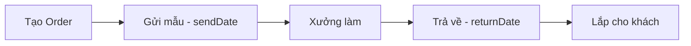

# 016.3 Labo Orders - Daily View

## 📋 Tổng Quan

**Feature**: Màn hình theo dõi hàng ngày - Mẫu gửi đi và nhận về

**Mục đích**:

- Theo dõi mẫu gửi xưởng hôm nay
- Theo dõi mẫu xưởng trả về hôm nay
- Checklist công việc hàng ngày
- Quick access để update status

**Route**: `/labo-orders/daily` (default route của Labo)

## 📊 Tham khảo

- Prisma Model: `prisma/schema.prisma` → LaboOrder
- Related Requirements:
  - `016.1 Labo Item Master.md` - LaboItem reference
  - `016.2 Labo Service Prices.md` - Pricing snapshot
  - `007 Customer.md` - Customer reference
  - `005 Employee.md` - Doctor reference
  - `015.2 Supplier Management.md` - Supplier reference
- Guidelines: `docs/GUIDELINES.md` → Nested Structure Pattern

---

## 🎯 User Stories

### US-1: Xem mẫu gửi đi hôm nay

**Là** Nhân viên/Bác sĩ  
**Tôi muốn** xem danh sách mẫu gửi xưởng hôm nay  
**Để** kiểm tra và đóng gói gửi đi

**Acceptance Criteria**:

- [ ] Collapsible Table "📤 Mẫu Gửi Đi" hiển thị orders có `sendDate` = date
- [ ] Badge đếm số lượng: "Mẫu Gửi Đi (5)"
- [ ] Table columns: Khách hàng, Bác sĩ, Xưởng, Loại răng, SL, Giá, Thao tác
- [ ] Sort mặc định: `createdAt desc` (mới nhất trước)
- [ ] Mặc định: Mở (expanded)

### US-2: Xem mẫu nhận về hôm nay

**Là** Nhân viên/Bác sĩ  
**Tôi muốn** xem danh sách mẫu xưởng trả về hôm nay  
**Để** kiểm tra và xác nhận nhận hàng

**Acceptance Criteria**:

- [ ] Collapsible Table "📥 Mẫu Nhận Về" hiển thị orders có `returnDate` = date
- [ ] Badge đếm số lượng: "Mẫu Nhận Về (3)"
- [ ] Table columns: Tương tự table gửi đi
- [ ] Sort mặc định: `returnDate asc` (sớm nhất trước)
- [ ] Mặc định: Mở (expanded)

### US-3: Điều hướng ngày

**Là** Nhân viên  
**Tôi muốn** xem mẫu của ngày khác  
**Để** tracking công việc quá khứ/tương lai

**Acceptance Criteria**:

- [ ] Date navigation: Previous Day | Today | Next Day + DatePicker
- [ ] URL sync: `/labo-orders/daily?date=2025-12-03`
- [ ] Default: Hôm nay
- [ ] Reload cả 2 tables + statistics khi đổi ngày

### US-4: Xem thống kê tổng quan

**Là** Manager  
**Tôi muốn** xem thống kê hôm nay  
**Để** nắm tình hình công việc

**Acceptance Criteria**:

- [ ] Statistics cards:
  - Gửi đi hôm nay (count + totalCost)
  - Nhận về hôm nay (count + totalCost)
- [ ] Auto refresh khi đổi ngày hoặc clinic

### US-5: Filter theo clinic

**Là** Admin  
**Tôi muốn** chọn clinic để xem data  
**Để** quản lý từng chi nhánh

**Acceptance Criteria**:

- [ ] Clinic Tabs hiển thị với `clinicCode`
- [ ] Employee: Auto-locked session clinic
- [ ] Admin: Chọn được bất kỳ clinic
- [ ] Reload data khi chuyển clinic

---

## 🎨 UI Design

### Structure

- **Component**: `LaboOrderDailyView.tsx` (client component)
- **Page**: `/labo-orders/daily`
- **Route**: `src/app/(private)/labo-orders/daily/page.tsx` (SSR with session)

### Components Hierarchy

```
LaboOrderDailyView
├── PageHeaderWithDateNav (shared component)
├── ClinicTabs (admin chọn clinic)
├── LaboOrderStatistics (KPI cards - 3 metrics)
├── LaboOrderFilters (search + create button)
└── CollapsibleTables (2 tables: Gửi đi + Nhận về)
```

### Date Navigation

- Component: `PageHeaderWithDateNav` (shared component)
- Hook: `useDateNavigation()`
- Default: Today
- Controls: Previous Day | Today | Next Day + DatePicker
- Format: YYYY-MM-DD (ISO) gửi lên API

### Clinic Selection (Admin Only)

- Component: `ClinicTabs` (shared component)
- Display: Tabs với `clinicCode` và `colorCode`
- Employee: Auto-locked to session clinic
- Admin: Chọn clinic để xem data

### Statistics (KPI) - 3 Cards

Component: `LaboOrderStatistics`:

| Metric          | Logic                               | Display     |
| --------------- | ----------------------------------- | ----------- |
| Gửi đi hôm nay  | Count orders có `sendDate` = date   | Count + VND |
| Nhận về hôm nay | Count orders có `returnDate` = date | Count + VND |

### Filters & Actions

- Component: `LaboOrderFilters`
- **Bên trái**: Search Input (tìm theo tên khách, tên xưởng - filter local)
- **Bên phải**:
  - Export Excel button (optional)
  - Create button: Mở `CreateLaboOrderModal`

### Collapsible Tables - 2 Tables

#### Table 1: Mẫu Gửi Đi (Mặc định mở)

- **Title**: "📤 Mẫu Gửi Đi ({count})"
- **Data**: Orders có `sendDate` = date
- **Sort**: Fixed `createdAt desc` (mới nhất trước)

#### Table 2: Mẫu Nhận Về (Mặc định mở)

- **Title**: "📥 Mẫu Nhận Về ({count})"
- **Data**: Orders có `returnDate` = date
- **Sort**: Fixed `returnDate asc` (sớm nhất trước)

**Shared Features:**

- No pagination: Load tất cả trong 1 trang
- Loading state: Skeleton
- Empty state: "Không có mẫu {gửi đi/nhận về} trong ngày"

### 📊 Table Columns (Both Tables)

| Column        | Width | Type    | Description                                                                                                     |
| ------------- | ----- | ------- | --------------------------------------------------------------------------------------------------------------- |
| Khách hàng    | 170px | Mixed   | Line 1: `{fullName}` **clickable link** → navigate to `/customers/{customerId}`<br>Line 2: Tag `{customerCode}` |
| Bác sĩ        | 120px | Text    | `{doctor.fullName}`                                                                                             |
| Ngày điều trị | 120px | Date    | Format: `DD/MM/YYYY` - `{treatmentDate}`                                                                        |
| Loại đơn hàng | 100px | Text    | `{orderType}` - "Làm mới" hoặc "Bảo hành"                                                                       |
| Xưởng         | 120px | Text    | `{supplier.shortName}` or `{supplier.name}`                                                                     |
| Loại răng     | 140px | Text    | Line 1: `{laboItem.name}`<br>Line 2: Secondary text `{serviceGroupLabel}` (nhỏ hơn, màu xám)                    |
| SL            | 50px  | Number  | `{quantity}`                                                                                                    |
| Ngày gửi mẫu  | 140px | Date    | Format: `DD/MM/YYYY HH:mm` - `{sendDate}`                                                                       |
| Ngày hẹn lắp  | 120px | Date    | Format: `DD/MM/YYYY` - `{expectedFitDate}` (nullable)                                                           |
| Ngày nhận mẫu | 140px | Date    | Format: `DD/MM/YYYY HH:mm` - `{returnDate}` (nullable)                                                          |
| Yêu cầu       | 150px | Text    | `{detailRequirement}` - Truncate với tooltip                                                                    |
| Thao tác      | 150px | Actions | Space with Divider: Nhận mẫu (Popconfirm), Edit button, Delete button                                           |

**Note:**

- Không có sorter/filter (dữ liệu ít, load fixed)
- Scroll width: ~910px
- Mobile: Responsive collapse

### Row Actions

**Layout**: Space with vertical dividers between actions

**Actions:**

1. **Nhận mẫu** (`CheckOutlined`):

   - Hiển thị: Chỉ khi `returnDate === null` (chưa nhận mẫu)
   - Popconfirm: "Bạn có chắc chắn đã nhận mẫu này từ xưởng?"
   - Action: Call Server Action `receiveLaboOrder(id)`
   - Result: Cập nhật `returnDate = now`, `receivedById = currentUserId`

2. **Edit** (`EditOutlined`):

   - Permission: `labo-orders:update`
   - Conditional Display:
     - Admin: Luôn hiển thị (có thể sửa mọi trạng thái)
     - Employee: Chỉ hiển thị khi `returnDate === null` (chưa nhận mẫu)
   - Tooltip:
     - Admin: "Sửa"
     - Employee + đã nhận mẫu: "Chỉ admin mới sửa được đơn đã nhận mẫu"
   - Disabled: Employee khi `returnDate !== null`
   - Action: Mở modal edit với full form (navigate to management page)

3. **Delete** (`DeleteOutlined`):
   - Permission: `labo-orders:delete`
   - Popconfirm: "Bạn có chắc chắn muốn xóa đơn hàng này?"
   - Action: Soft delete

### Query Logic

**Mẫu gửi đi**: Filter `sendDate = selected date`

**Mẫu nhận về**: Filter `returnDate = selected date`

### Response Type

```typescript
DailyLaboOrderResponse {
  id: string

  customer: {
    id: string
    fullName: string
    customerCode: string
  }

  doctor: {
    id: string
    fullName: string
  }

  treatmentDate: string          // "2025-12-08" (YYYY-MM-DD)
  orderType: string              // "Làm mới" | "Bảo hành"

  sentBy: {
    id: string
    fullName: string
  }

  supplier: {
    id: string
    name: string
    shortName: string | null
  }

  laboItem: {
    name: string
    serviceGroup: string         // "rang-toan-su"
    serviceGroupLabel: string    // "Răng toàn sứ"
  }

  quantity: number
  totalCost: number

  sendDate: string               // ISO DateTime
  returnDate: string | null      // ISO DateTime
  expectedFitDate: string | null // "2025-12-15" (YYYY-MM-DD)

  detailRequirement: string | null
}
```

### Statistics Response

```typescript
DailyStatistics {
  sentToday: {
    count: number
    totalCost: number
  }

  returnedToday: {
    count: number
    totalCost: number
  }
}
```

---

## 💾 Data Model

### Prisma Model

```prisma
model LaboOrder {
  id String @id @default(uuid())

  // References
  customerId String
  doctorId   String
  supplierId String
  laboItemId String
  clinicId   String

  // Business Fields (NEW)
  treatmentDate DateTime  @db.Date       // Ngày bác sĩ điều trị (required)
  orderType     String                   // "Làm mới" | "Bảo hành" (required)
  sentById      String                   // Nhân viên gửi mẫu đi xưởng (required)

  // Pricing (Snapshot from LaboService at creation time)
  unitPrice  Int    // Snapshot price per unit
  quantity   Int    // Số lượng
  totalCost  Int    // = unitPrice * quantity
  warranty   String // Snapshot warranty: "5-nam"

  // Dates
  sendDate        DateTime  @default(now()) @db.Timestamptz // Ngày gửi mẫu đi xưởng (auto-set)
  returnDate      DateTime? @db.Timestamptz // Ngày nhận mẫu về từ xưởng (nullable)
  expectedFitDate DateTime? @db.Date // Ngày dự kiến lắp cho khách (optional, nullable)

  // Details
  detailRequirement String? // Ghi chú yêu cầu chi tiết cho xưởng

  // Tracking
  receivedById String? // Nhân viên xác nhận nhận mẫu

  // Metadata
  createdById String
  updatedById String
  createdAt   DateTime @default(now()) @db.Timestamptz
  updatedAt   DateTime @updatedAt @db.Timestamptz

  // Relations
  customer Customer @relation(fields: [customerId], references: [id])
  doctor   Employee @relation("DoctorLaboOrders", fields: [doctorId], references: [id])
  sentBy   Employee @relation("SentLaboOrders", fields: [sentById], references: [id])
  supplier Supplier @relation(fields: [supplierId], references: [id])
  laboItem LaboItem @relation(fields: [laboItemId], references: [id])
  clinic   Clinic   @relation(fields: [clinicId], references: [id])

  receivedBy Employee? @relation("ReceivedLaboOrders", fields: [receivedById], references: [id])
  createdBy  Employee  @relation("CreatedLaboOrders", fields: [createdById], references: [id])
  updatedBy  Employee  @relation("UpdatedLaboOrders", fields: [updatedById], references: [id])

  // Indexes
  @@index([clinicId, sendDate])
  @@index([clinicId, returnDate])
  @@index([customerId])
  @@index([supplierId])
}
```

**Key Design Decisions:**

- **Business Fields (NEW)**:
  - `treatmentDate`: DateTime @db.Date - Ngày bác sĩ điều trị (required, chỉ ngày)
  - `orderType`: String - "Làm mới" hoặc "Bảo hành" (required, lưu trực tiếp tiếng Việt)
  - `sentById`: String - Nhân viên gửi mẫu đi xưởng (required, relation to Employee)
- **Snapshot Pricing**: `unitPrice`, `warranty` lưu giá tại thời điểm tạo order (không bị ảnh hưởng khi LaboService thay đổi giá)
- **Date Fields**:
  - `treatmentDate`: DateTime @db.Date (required, chỉ ngày)
  - `sendDate`: DateTime @db.Timestamptz (auto-set to now(), bao gồm giờ phút giây)
  - `returnDate`: DateTime? @db.Timestamptz (nullable, bao gồm giờ phút giây)
  - `expectedFitDate`: DateTime? @db.Date (nullable, chỉ ngày)
- **Tracking**:
  - `sentById`: Nhân viên gửi mẫu (required, set khi tạo order)
  - `receivedById`: Nhân viên xác nhận nhận mẫu (nullable - chỉ set khi nhận)
- **Indexes**: Optimize queries theo clinic + date range

---

## 🔄 Server Actions & API

### Server Actions

**Location**: `src/server/actions/labo-orders/`

#### `getLaboOrdersDaily`

- **Input**: `{ date, type: 'sent' | 'returned', clinicId? }`
- **Permission**: `labo-orders:view-daily`
- **Returns**: `{ items: DailyLaboOrderResponse[], total: number }`

#### `getDailyStatistics`

- **Input**: `{ date, clinicId? }`
- **Returns**: `DailyStatistics`

#### `receiveLaboOrder`

- **Input**: `{ orderId }`
- **Permission**: `labo-orders:receive`
- **Logic**:
  - Update `returnDate = now`
  - Update `receivedById = currentUserId`
- **Validation**: Order must exist, `returnDate` must be null
- **Returns**: `{ success: boolean }`

---

## 🔐 Permissions

### View

```typescript
"labo-orders:view-daily";
```

- Roles: admin, employee

### Receive Order

```typescript
"labo-orders:receive";
```

- Roles: admin, employee

### Update Order

```typescript
"labo-orders:update";
```

- Roles: admin, employee
- Business Rule:
  - Admin: Có thể sửa mọi order (kể cả đã nhận mẫu)
  - Employee: Chỉ sửa được order chưa nhận mẫu (`returnDate === null`)

### Delete Order

```typescript
"labo-orders:delete";
```

- Roles: admin

### Create Order

```typescript
"labo-orders:create";
```

- Roles: admin, employee

---

## 🧪 Test Cases

### TC-1: View Sent Today

```
Given: Có 5 orders với sendDate = hôm nay
When: Mở tab "Mẫu gửi đi"
Then:
  - Hiển thị 5 orders
  - Badge "Mẫu gửi đi (5)"
  - Statistics card: 5 đơn
```

### TC-2: View Returned Today

```
Given: Có 3 orders với returnDate = hôm nay
When: Mở tab "Mẫu nhận về"
Then:
  - Hiển thị 3 orders
  - Badge "Mẫu nhận về (3)"
```

### TC-3: Navigate to Yesterday

```
Given: Hôm nay có 5 orders gửi đi
And: Hôm qua có 3 orders gửi đi
When: Click "◀ Hôm qua"
Then:
  - URL: ?date=2025-12-02
  - Hiển thị 3 orders của hôm qua
  - Date picker: "02/12/2025"
```

### TC-4: Receive Sample

```
Given: Order có returnDate = null (chưa nhận mẫu)
When: Click "Nhận mẫu" và xác nhận popconfirm
Then:
  - returnDate = now
  - receivedById = current user
  - Button "Nhận mẫu" biến mất
  - Toast success "Đã xác nhận nhận mẫu"
  - Table refresh
```

### TC-5: Filter by Clinic

```
Given: PNK có 5 orders, HCM có 3 orders
When: Click tab "PNK (5)"
Then: Chỉ hiển thị 5 orders của PNK
```

### TC-6: Edit Order - Admin Can Edit Returned Order

```
Given: Admin user, order có returnDate !== null (đã nhận mẫu)
When: Click button Edit
Then:
  - Button enabled, không bị disable
  - Navigate to management page với order ID
  - Modal/form edit hiển thị với dữ liệu order
```

### TC-6.1: Edit Order - Employee Cannot Edit Returned Order

```
Given: Employee user, order có returnDate !== null (đã nhận mẫu)
When: Hover button Edit
Then:
  - Button disabled
  - Tooltip: "Chỉ admin mới sửa được đơn đã nhận mẫu"
  - Click không có tác dụng
```

### TC-6.2: Edit Order - Employee Can Edit Pending Order

```
Given: Employee user, order có returnDate === null (chưa nhận mẫu)
When: Click button Edit
Then:
  - Button enabled
  - Navigate to management page với order ID
  - Modal/form edit hiển thị với dữ liệu order
```

### TC-7: Delete Order

```
Given: Admin user, order tồn tại
When: Click Delete button và xác nhận popconfirm
Then:
  - Order bị soft delete
  - Toast success "Đã xóa đơn hàng"
  - Table refresh, order biến mất khỏi danh sách
```

---

## 💡 Business Logic

### Daily Tracking Workflow



### Customer Notification Reminder

**Rule**: Khi order có `returnDate` = hôm nay, hiển thị reminder "✅ Gọi nhắc khách đến lắp"

**Implementation** (Future):

- Auto SMS/Zalo notification
- Track notification sent status

---

## 📊 Related Features

### Integration Points

1. **Customer Detail - Tab Labo**:

   - Link từ customer name → Customer detail
   - Hiển thị tất cả orders của khách

2. **Labo Reports (016.4)**:

   - Daily view chỉ tracking, Reports để phân tích

3. **Calendar Integration** (Future):
   - returnDate sync với Calendar
   - Remind doctor/staff

---

## 📋 Implementation Checklist

### Backend

- [ ] Repository: `getDailyLaboOrders(date, type, clinicId)` - Query with date range filter
- [ ] Repository: `getDailyStatistics(date, clinicId)` - Aggregate sent/returned counts
- [ ] Repository: `receiveLaboOrder(id, receivedById)` - Update returnDate & receivedById
- [ ] Repository: `deleteLaboOrder(id)` - Soft delete
- [ ] Service: Business logic layer for daily operations
- [ ] Server Action: `getLaboOrdersDaily` - Get daily orders list
- [ ] Server Action: `getDailyStatistics` - Get statistics
- [ ] Server Action: `receiveLaboOrder` - Xác nhận nhận mẫu
- [ ] Server Action: `deleteLaboOrder` - Xóa đơn hàng

### Frontend

- [ ] Hooks (`src/features/labo-orders/hooks/`):
  - [ ] `useLaboOrdersDaily` - Query hook wrap getLaboOrdersDaily
  - [ ] `useDailyStatistics` - Query hook wrap getDailyStatistics
  - [ ] `useReceiveLaboOrder` - Mutation hook with invalidation
  - [ ] `useDeleteLaboOrder` - Mutation hook with invalidation
- [ ] Components (`src/features/labo-orders/components/`):
  - [ ] `LaboOrderStatistics.tsx` - 2 KPI cards
  - [ ] `LaboOrderFilters.tsx` - Search + Create button
  - [ ] `LaboOrderCollapsibleTables.tsx` - 2 collapsible tables (Sent/Returned)
- [ ] View: `LaboDailyView.tsx` - Main daily view component
- [ ] Constants: Query keys, messages

### UI/UX

- [ ] Responsive table (mobile friendly)
- [ ] Loading skeletons for tables and statistics
- [ ] Empty states ("Không có mẫu gửi đi hôm nay")
- [ ] Error handling with user-friendly messages
- [ ] Toast notifications for success/error actions

---

## 🎯 Future Enhancements

### Phase 2

- [ ] Calendar view (monthly view với dots)
- [ ] Drag-and-drop to reschedule returnDate
- [ ] Print delivery notes (phiếu gửi xưởng)

### Phase 3

- [ ] Auto SMS reminder to customers
- [ ] WhatsApp/Zalo integration
- [ ] Track delivery status with supplier API
- [ ] Photo upload (trước/sau lắp răng)

---

## 🔗 Related Requirements

- **016.1 Labo Item Master**: Reference LaboItem
- **016.2 Labo Service Prices**: Get pricing info
- **016.4 Labo Reports**: Analytics và phân tích
- **008 Appointment**: returnDate có thể sync với appointment
- **007.1 Customer Detail**: Link to customer từ daily view

---

**Version**: 1.0  
**Last Updated**: 2025-12-04  
**Status**: Ready for Implementation

---

## 🎲 Decision Log

### Database & Business Rules

- ✅ **Snapshot Pricing Strategy**:
  - Lưu `unitPrice`, `warranty` từ LaboService tại thời điểm tạo order
  - Order không bị ảnh hưởng khi xưởng thay đổi giá
  - Báo cáo chính xác chi phí thực tế đã phát sinh
- ✅ **Business Fields** (Added 2025-12-08):
  - `treatmentDate` (required): Ngày bác sĩ điều trị - DateTime @db.Date
  - `orderType` (required): "Làm mới" | "Bảo hành" - Lưu trực tiếp tiếng Việt (không dùng code)
  - `sentById` (required): Nhân viên gửi mẫu - relation to Employee
- ✅ **Date Fields**:
  - `sendDate` (required): Ngày gửi mẫu đi xưởng - Auto-set to now()
  - `returnDate` (nullable): Ngày nhận mẫu về - set khi click "Nhận mẫu"
  - `expectedFitDate` (nullable): Ngày dự kiến lắp - optional field
  - `treatmentDate` (required): Ngày điều trị - required field
- ✅ **Tracking Fields**:
  - `sentById`: Nhân viên gửi mẫu (required - set khi tạo order)
  - `receivedById`: Nhân viên xác nhận nhận mẫu (nullable - set khi click "Nhận mẫu")
- ❌ **Removed**: `toothPositions` - Không cần thiết cho labo orders
- ✅ **Daily View Queries**:
  - Mẫu gửi đi: Filter `sendDate = date`
  - Mẫu nhận về: Filter `returnDate = date`
  - No pagination: Load all orders trong ngày

### Repository Pattern

```typescript
// Complex + Server Fields pattern
type LaboOrderCreateInput = CreateLaboOrderRequest & {
  unitPrice: number; // Snapshot from LaboService
  totalCost: number; // Calculated: unitPrice * quantity
  warranty: string; // Snapshot from LaboService
  createdById: string; // Current user
  updatedById: string; // Current user
  clinicId: string; // Current user's clinic
};
```

### Permission Rules

**Quyền dựa trên: Role + returnDate status**

#### CREATE

- Employee/Admin: Tạo cho clinic của mình
- **Ràng buộc**: Phải chọn supplier type = "labo-xuong-rang-gia"

#### UPDATE

| User Type | Condition                     | Allowed                       |
| --------- | ----------------------------- | ----------------------------- |
| Admin     | Always                        | ✅ Sửa tất cả fields          |
| Employee  | returnDate === null           | ✅ Sửa (trừ pricing snapshot) |
| Employee  | returnDate !== null (đã nhận) | ❌ Không sửa                  |

#### DELETE

| User Type | Permission    |
| --------- | ------------- |
| Admin     | ✅ Xóa tất cả |
| Employee  | ❌ Không xóa  |

#### QUICK ACTIONS (Receive Sample)

- Employee/Admin: Xác nhận nhận mẫu cho clinic của mình
- **Action**: Set `returnDate = now`, `receivedById = currentUserId`
- **Validation**: Order must exist, `returnDate` must be null

### Architecture

- ✅ **Hybrid**: GET qua API Routes + Mutations qua Server Actions
- ✅ **Daily View Pattern**: 2 collapsible tables (Sent/Returned)
- ✅ **Statistics**: Real-time KPI cards
- ✅ **Date Navigation**: Shared component `PageHeaderWithDateNav`
- ✅ **Clinic Tabs**: Admin can switch, Employee locked to own clinic

---
